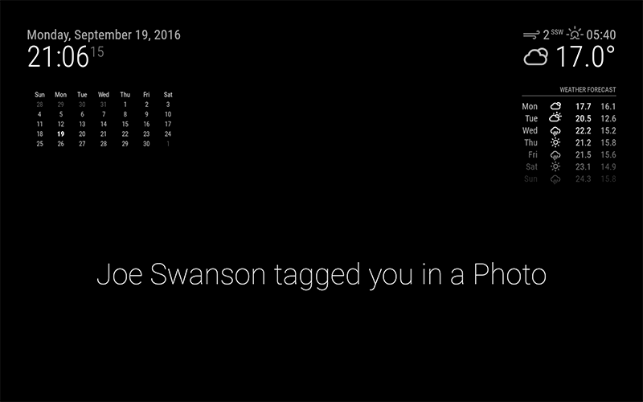

# MMM-WebHookAlerts
[MagicMirror](https://magicmirror.builders/) The MMM-WebHookAlerts module for [MagicMirror](https://magicmirror.builders/) will display a message on your MagicMirror when a [webhook notification](https://en.wikipedia.org/wiki/Webhook) is received. When a webhook notification message is received, then it is displayed fullscreen on the MagicMirror. You can specify what is displayed by the use of templates, and you can even pull data from the body of the HTTP Post in Json format into the template because the template engine used is [Mustache](https://www.npmjs.com/package/mustache). You can define multiple templates for different webhook notifications by the use of a query string parameter called 'templateName'



This module is intended to display immediate notifications of events from any device that can send a HTTP Post message.
Notifications will show for a default of 60 seconds before disappearing. There is no on-screen history of events.

## Module installation

Clone the module and npm install:

```bash
cd ~/MagicMirror/modules
git clone https://github.com/PJTewkesbury/MMM-WebHookAlerts.git
cd MMM-WebHookAlerts
npm install
```

Add the module config to `~/MagicMirror/config/config.js`

```javascript
modules: [
    {
        module: 'MMM-WebHookAlerts',        
        position: 'fullscreen_above',
        config: {
                fadeSpeed: 30,
				displaySeconds:90,
				sound:"twip.wav",
				templates:
					[
						{
							templateName: "AzureDevOps",
							template: "<div style='height:100%; background-color: #202020; color:white;border: 3px solid black; padding:5px'><h1>{{resource.definition.project.name}}</h1><br/><b>{{message.text}}</b></div>",
							sound:"wobble.wav",
						},
						{
							templateName: "SimpleAlert",
							template: "<div class='fullscreen' style='border:1px solid black;'><b>{{message}}</b></div>",
							displaySeconds:10,
							fadeSpeed:10,
							sound:"wobble.wav",
						}
					]    
        }
    }
]
```


## Module Configuration Options

<table width="100%">
    <thead>
        <tr>
            <th>Option</th>
            <th>Type</th>
            <th>Default</th>
            <th width="100%">Description</th>
        </tr>
    <thead>
    <tbody>
        <tr>
            <td><code>displaySeconds</code></td>
            <td>Integer</td>
            <td><code>60</code></td>
            <td>Number of seconds to show a notification for</td>
        </tr>
        <tr>
            <td><code>fadeSpeed</code></td>
            <td>Integer</td>
            <td><code>3000</code></td>
            <td>Milliseconds fade transition speed</td>
        </tr>
        <tr>
            <td><code>size</code></td>
            <td>String</td>
            <td><code>large</code></td>
            <td>Text size, options are: small, medium, large, xlarge</td>
        </tr>
	    <tr>
            <td><code>templates</code></td>
            <td>Array of template</td>
            <td><code>
		templateName: "DevOps",
		template: "<div style='height:600px; background-color: lightgray; color:black; border: 3px solid white; padding:15px'><h3>{{resource.definition.project.name}}</h3><br/>{{message.text}}</div>",
		sound:"wobble.wav",
		</code></td>
            <td>Text size, options are: small, medium, large, xlarge</td>
        </tr>	    
        </tr>
	    <tr>
            <td><code>templateName</code></td>
            <td>String</td>
            <td><code>Name of the templalte</code></td>
            <td>The webhook url query string parameter is matched to this value</td>
        </tr>	
        </tr>
	    <tr>
            <td><code>template</code></td>
            <td>String</td>
            <td><code>A html mustache template</code></td>
            <td>This is the html mustache template</td>
        </tr>
	
        </tr>
	    <tr>
            <td><code>sound</code></td>
            <td>String</td>
            <td><code>wobble.mp3</code></td>
            <td>optional - This is the name of the sound to play when the alert is shown</td>
        </tr>

    </tbody>
</table>


## Setting up a WebHookAlerts

### Making your mirror internet accessible

For this module to work, you will need to get dirty with your router, specifically with Port Forwarding.

I'm not going to go into detail here, there are plenty of [Google results](https://www.google.com.au/?gws_rd=ssl#q=router+port+forwarding)
 on the topic.

You will need to forward any port you nominate, to the local IP of your Magic Mirror on port 8080.

You will also need to set up a dynamic DNS hostname for your home network, I'm a [Duckdns](https://www.duckdns.org/)
 fan personally. Atlernatively you could look into a http forward solution like [ngrok](https://ngrok.com/). 

### Templates
We use mustas

### IFTTT Maker Recipes

Log in to [IFTTT](https://ifttt.com/) and create a new recipe. You can essentially choose any channel
 you want for the Trigger but for the Action channel you must select Maker.

There is only one Action, "Make a web request".

Action fields explained:

<table width="100%">
    <thead>
        <tr>
            <th>Field</th>
            <th>Description</th>
            <th>Example</th>
        </tr>
    <thead>
    <tbody>
        <tr>
            <td>URL</td>
            <td>Notification endpoint</td>
            <td>http://yourhouse.duckdns.org:8080/IFTTT</td>
        </tr>
        <tr>
            <td>Method</td>
            <td>HTTP Method, MUST be POST</td>
            <td>POST</td>
        </tr>
        <tr>
            <td>Content Type</td>
            <td>How the data is sent</td>
            <td>application/json</td>
        </tr>
        <tr>
            <td>Body</td>
            <td>The notification content, explained below</td>
            <td><pre><code>{
    "message": "<<<{{From}}>>> tagged you in a Photo",
    "displaySeconds": 45,
    "size": "large"
}</code></pre></td>
        </tr>
    </tbody>
</table>

The notification body JSON MUST contain the `message` item. If it doesn't, the endpoint will return a 400 error.
 All of the configuration options can also be passed with the JSON, which will override the config for
 that recipe only.

The `<<<{{From}}>>>` in the example above is a IFTTT wildcard field that you select in the Body section
 of the action. You can create any message you like that incorporates any wildcard. Stay away from fields that may
 contain HTML or links, they won't display well. These fields should be surrounded in `<<<` and `>>>` strings in
 order for the field to be escaped properly.

## Using additional modules

This module will send out notifications to other supported modules, if those options are included in the notification JSON.
The supported modules are:

#### [MMM-Sounds](https://github.com/jc21/MMM-Sounds)

This additional module can play audio sounds if your mirror supports it. An example of a notification that would play a Sound:

```json
{
    "message": "<<<{{From}}>>> tagged you in a Photo",
    "displaySeconds": 45,
    "size": "large",
    "sound": "wobble.wav"
}
```

Or with a delay:

```json
{
    "message": "<<<{{From}}>>> tagged you in a Photo",
    "displaySeconds": 45,
    "size": "large",
    "sound": {
        "sound": "wobble.wav",
        "delay": 1000
    }
}
```

You may want to use the delay approach to manually align the sound you're using with the light sequence, or to time the wakeup of the screen as well.


## Testing the Mirror Endpoint

```bash
curl -X POST -H "Content-Type: application/json" \
    -d '{"message": "Your pizza is ready!"}' \
    "http://yourhouse.duckdns.org:8080/webhook?template=test"
```
